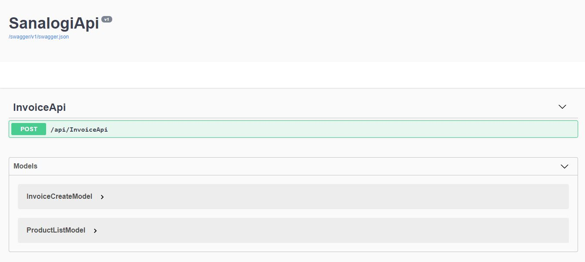
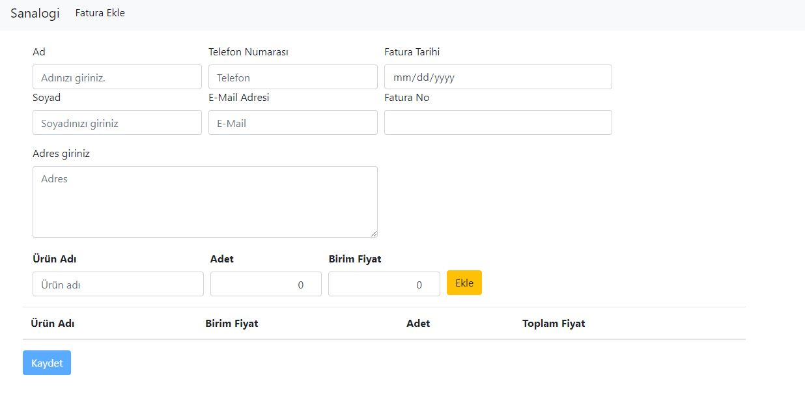
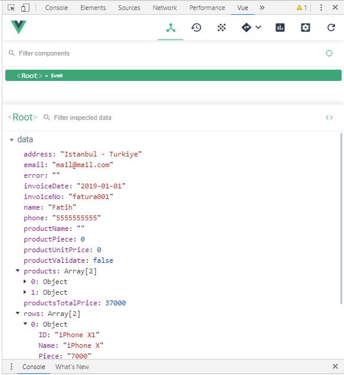
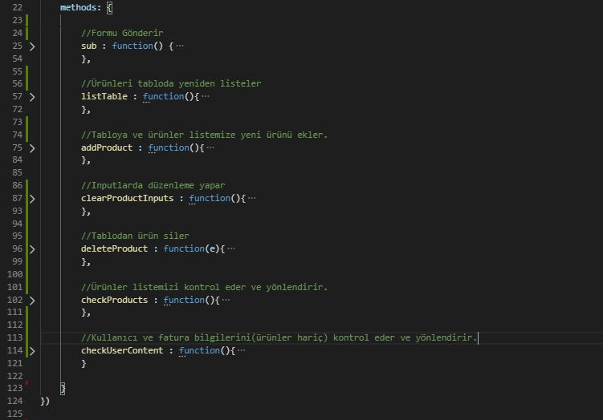

# SanalogiProject
# Sanalogi .Net Core - Vue JS
Bu projede Vue JS ile hazırlanmış bir UI üzerinden ASP Net Core Web API'sine veri gönderilip,gönderilen veri veritabanına işlenebilir.

Kullanılan teknolojiler;

 - Asp .Net Core Web Api
 - Vue JS
 - Entity Framework
 - Sqlite
 - Swagger

Başlatmak için dizinde aşağıdaki komutu kullanarak ya da Visual Studio üzerinden çalıştırabilirsiniz.  
 <code>

    dotnet run
 </code>

 *  Eğer projeyi IIS kullanarak ayağa kaldıracaksanız Start butonu veya;  
 http://localhost:{your_port}/swagger 
 *  Kestrel kullanarak kaldıracaksanız aşağıdaki linke gidebilirsiniz. 
 http://localhost:{your_port}/swagger

<h3>------------------------------------</h3>

 Uygulamayı /swagger 'da açınca sizi aşağıdaki ekran karşılayacaktır;

 

*   Bu ekranda Swagger kullanarak Apiye test isteği gönderebilir,kullanılan model ve methodu görebilirsiniz.

<h4>Invoice Model</h4>
<code>

        [Key]
        public int InvoiceID { get; set; }
        [Required]
        public string Name { get; set; }
        [Required]
        public string Surname { get; set; }
        [MaxLength(30)]
        [Required]
        public string Email { get; set; }
        [MaxLength(25)]
        public string Phone { get; set; }
        public string Address { get; set; }
        public DateTime InvoiceDate { get; set; }
        public string InvoiceNo { get; set; }
        public List<ProductListModel> Products{ get; set; }
        public decimal TotalPrice { get; set; }
</code>

* Burada veritabanına yazdırmak için kullanacağımız verilerin tiplerini ve isimlerini belirten bir model oluşturduk.

<h4>ProductListModel</h4>

<code>
    
    [NotMapped]
    public class ProductListModel
    {
        public string Name { get; set; }
        public int Piece { get; set; }
        public decimal UnitPrice { get; set; }
    }
</code>

*   Bu modelimizi Invoice modelde kullandığımız Products veri tipine yardımcı olmak için kullanıyoruz.
*   [NotMapped] etiketi,Entity Framework ile veritabanını modellerken ProductListModel tablosu oluşmaması için kullanılmıştır.

<h4>InvoiceCreateModel</h4>

<code>
    
    [NotMapped]
    public class InvoiceCreateModel
    {
        public string Name { get; set; }
        public string Surname { get; set; }
        public string Email { get; set; }
        public string Phone { get; set; }
        public string Address { get; set; }
        public DateTime InvoiceDate { get; set; }
        public string InvoiceNo { get; set; }
        public List<ProductListModel> Products { get; set;}
    }
</code>

*   Bu modelimiz ise Controller'ımızda bize yardımcı olması için tasarlanmıştır.

Methoda göz attığınızda aşağıdaki kod bloğu sizi karşılayacaktır;

<h4>InvoiceController</h4>

<code>

    [EnableCors("AllowMyOrigin")]
    [Route("api/[controller]")]
    [ApiController]
    public class InvoiceApiController : ControllerBase
    {
        [HttpPost]
        public string AddInvoice(InvoiceCreateModel model)
        {
            if (ModelState.IsValid)
            {
                InvoiceModel invoice = new InvoiceModel();

                try
                {
                    invoice.Name = model.Name;
                    invoice.Surname = model.Surname;
                    invoice.Email = model.Email;
                    invoice.Phone = model.Phone;
                    invoice.Address = model.Address;
                    invoice.InvoiceDate = model.InvoiceDate;
                    invoice.InvoiceNo = model.InvoiceNo;
                    invoice.Products = model.Products;
                    decimal totalPrice = 0;
                    foreach (var item in model.Products)
                    {
                        totalPrice += item.UnitPrice * item.Piece;
                    }
                    invoice.TotalPrice = totalPrice;
                    using (var db = new SanalogiDbContext())
                    {
                        db.Invoices.Add(invoice);
                        db.SaveChanges();
                    }
                    return "Kayıt başarılı!";

                }
                catch (Exception ex)
                {
                    return "Kayıt başarısız:" + ex.Message;
                }

            }
            return "Hatalı bilgi girdiniz.";
        }

    }
</code>

*   Methodumuz bilgilerin doğru gelmesi halinde veritabanına kaydı gerçekleştiriyor ve başarılı mesajı dönüyor.Aksi takdirde ise olumsuz mesaj dönüyor.

<h4>Startup.cs</h4>

<code>

    public void ConfigureServices(IServiceCollection services)
        {
            services.AddMvc().SetCompatibilityVersion(CompatibilityVersion.Version_2_2);

            //Database ve SQLite 'yi servislerimize eklediğimiz kod.
            services.AddDbContext<SanalogiDbContext>(options =>
            {
                options.UseSqlite(Configuration.GetConnectionString("Sqlite"));
            });

            //Swagger' ı servislerimize eklediğimiz alan
            services.AddSwaggerGen(c =>
            {
                c.SwaggerDoc("v1", new Info { Title = "SanalogiApi", Version = "v1" });
            });

            //CORS Policy'i ezdiğimiz kısım.
            services.AddCors(o => o.AddPolicy("AllowMyOrigin", builder => {
                builder.AllowAnyOrigin()
                       .AllowAnyMethod()
                       .AllowAnyHeader();
            }));
        }
</code>

*   Projenin ana rotasında ise sizi aşağıdaki ekran karşılayacaktır.

Chrome konsolunu açıp eğer yüklü ise Vue eklentisi sekmesinden client tarafında kullanılan değişkenleri görüntüleyebilirsiniz;

Form üzerindeki verileri doldururken bu değişkenler model olarak bağlandığı input nesnesinin değerini alıyor.

<h4>wwwroot/js/site.js</h4>

Oluşturulan methodlar yukarıdaki gibidir.Kullanılan kütüphaneler ise aşağıdaki gibidir;
<ul>
    <li>Vue JS</li>
    <li>Bootstrap</li>
    <li>Jquery</li>
    <li>Axios</li>
</ul>

<h2>Fatih Çinar</h2>